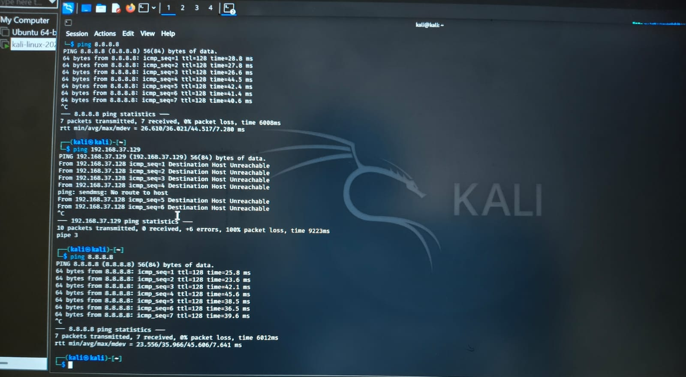
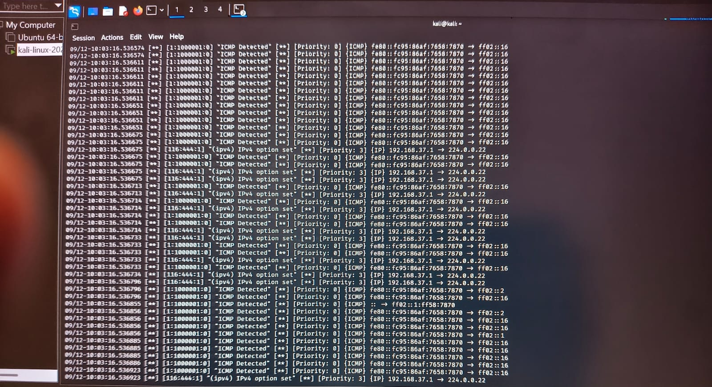

# Snort ICMP Traffic Detection

## Overview

This project demonstrates ICMP traffic detection using Snort IDS in a controlled cybersecurity lab environment.

ICMP traffic was generated from Kali Linux by sending ping requests to a lab host. Snort monitored the network traffic and generated ICMP detection alerts.

## Lab Environment

- Traffic Source: Kali Linux
- Target: Windows/Lab Host
- IDS: Snort
- Protocol: ICMP
- Environment: Controlled personal lab

## Project Workflow

1. Configured Snort IDS in the lab environment.
2. Generated ICMP traffic from Kali Linux.
3. Sent ping requests to the lab host.
4. Monitored the network traffic using Snort.
5. Observed ICMP detection alerts generated by Snort.
6. Reviewed the generated alerts for security monitoring.

## ICMP Traffic Generation

ICMP traffic was generated from Kali Linux using the `ping` command.

## Snort Detection

Snort detected ICMP traffic and generated corresponding detection alerts.

## SOC Relevance

Monitoring ICMP traffic can help a SOC analyst investigate unusual network activity.

Relevant indicators may include:

- Repeated ICMP requests
- Unexpected source hosts
- Host discovery activity
- Unusual network communication patterns

## Future Improvements

- Forward Snort alerts to Wazuh or Splunk
- Create custom Snort detection rules
- Generate SIEM alerts
- Correlate Snort alerts with Windows logs
- Build a security monitoring dashboard

## Disclaimer

This project was performed in a controlled personal lab environment for cybersecurity learning and defensive monitoring purposes.
